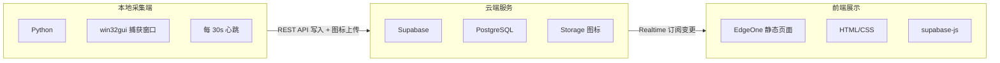

---
title: 做了一个可以让大家视奸我的网站
published: 2026-06-08
description: 欢迎大家访问me.flygeon.top来视奸我喵
tags: [Python, Supabase, 实时监控, EdgeOne, 前端开发]
category: 有趣的项目
draft: false
aigc: ai
---

## 缘起
没别的，之前就看到有类似的项目了，不过那个项目是部署在Docker上的，需要依赖服务器运行，我就在想能不能前后端分离，将项目直接部署到EdgeOne或者Vercel上。

于是有了这个项目：**Looking-me**
::github{repo="Flygeon/Looking-me"}

## 效果预览


## 架构设计




### 1. 本地采集端 (Python)

用 `win32gui` 获取当前活动窗口标题，`psutil` 获取进程名，通过 Supabase REST API 写入：

```python
# 获取活动窗口
hwnd = win32gui.GetForegroundWindow()
title = win32gui.GetWindowText(hwnd)

# 通过 REST API 写入 Supabase
rest_post("windows", {
    "id": 1,
    "title": title,
    "process": exe_name,
    "updated_at": "now()",
})

# 同时累积使用时长
usage[prev_process] += elapsed
rest_post("usage_stats", {"process": proc, "seconds": secs})
```

每 30 秒轮询一次，窗口变化时立即推送，同时每轮发送心跳保持在线状态。

### 2. 前端 (HTML + supabase-js)

前端是一个纯静态 HTML 文件，通过 `supabase-js` 的 Realtime 功能订阅数据库变更：

```javascript
// 订阅 realtime 变更
sb.channel('w')
  .on('postgres_changes', {
    event: '*',
    schema: 'public',
    table: 'windows',
    filter: 'id=eq.1'
  }, (payload) => {
    show(payload.new);   // 实时更新界面
  })
  .subscribe();
```

窗口切换时毫秒级响应，离线超过 60 秒自动显示 "似了" 骷髅。

## 部署教程

### 第一步：创建 Supabase 项目

1. 打开 [supabase.com](https://supabase.com)，注册/登录
2. 点击 **New Project**，填写名称和密码，完成创建

### 第二步：建表


在 SQL Editor 执行：

```sql
-- 当前窗口表
CREATE TABLE public.windows (
  id          INTEGER PRIMARY KEY DEFAULT 1,
  title       TEXT NOT NULL DEFAULT '',
  process     TEXT NOT NULL DEFAULT '',
  updated_at  TIMESTAMPTZ NOT NULL DEFAULT now()
);

-- 使用统计表
CREATE TABLE public.usage_stats (
  process    TEXT PRIMARY KEY,
  seconds    INTEGER NOT NULL DEFAULT 0,
  icon_url   TEXT,
  updated_at TIMESTAMPTZ NOT NULL DEFAULT now()
);

-- Realtime
ALTER PUBLICATION supabase_realtime ADD TABLE public.windows;
ALTER PUBLICATION supabase_realtime ADD TABLE public.usage_stats;

-- RLS
CREATE POLICY "allow_anon" ON public.windows FOR ALL USING (id = 1) WITH CHECK (id = 1);
CREATE POLICY "allow_anon" ON public.usage_stats FOR ALL USING (true) WITH CHECK (true);

INSERT INTO public.windows (id, title, process) VALUES (1, '', '');
```

然后执行 github里的 `migration_icons.sql` 创建图标存储桶。

### 第三步：获取 API 凭据

Supabase 控制台 → **Settings** → **API Keys**，记下：

- **Project URL**（形如 `https://xxxx.supabase.co`）
- **anon public key**（以 `eyJhbGci...` 开头）

### 第四步：配置本地采集端

打开 `window_monitor.py`，修改第 5-6 行：

```python
SUPABASE_URL = "https://你的项目.supabase.co"
SUPABASE_KEY = "你的anon key"
```
### 第五步：上传前端
将生成的 `index.html` 、 `styles.css` 以及 `icon.png` 上传到 EdgeOne Pages：

### 第六步：启动

```powershell
python window_monitor.py
```

看到 `[OK] Connected, tracking...` 即表示成功。打开 EdgeOne 地址即可实时查看窗口活动。

访问 [me.flygeon.top](https://me.flygeon.top)即可看到我在干啥~~（如果我还没似的话）~~
